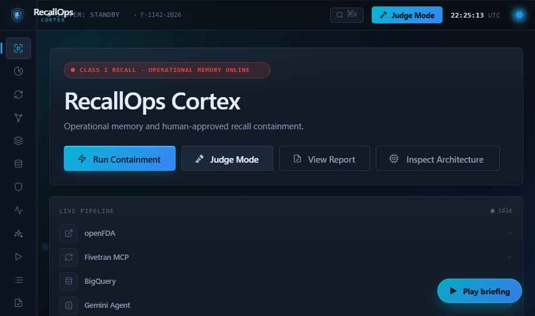
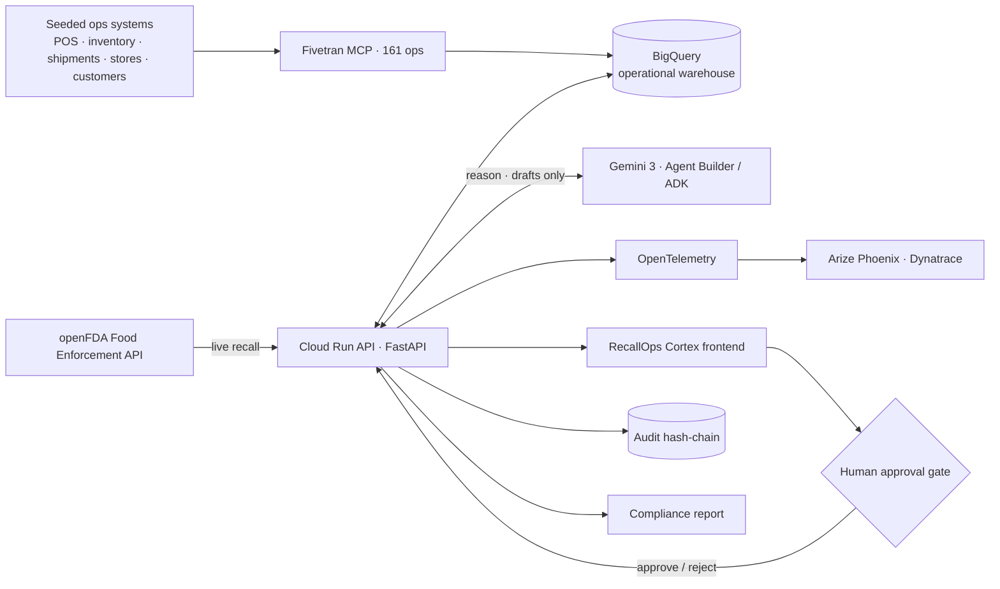
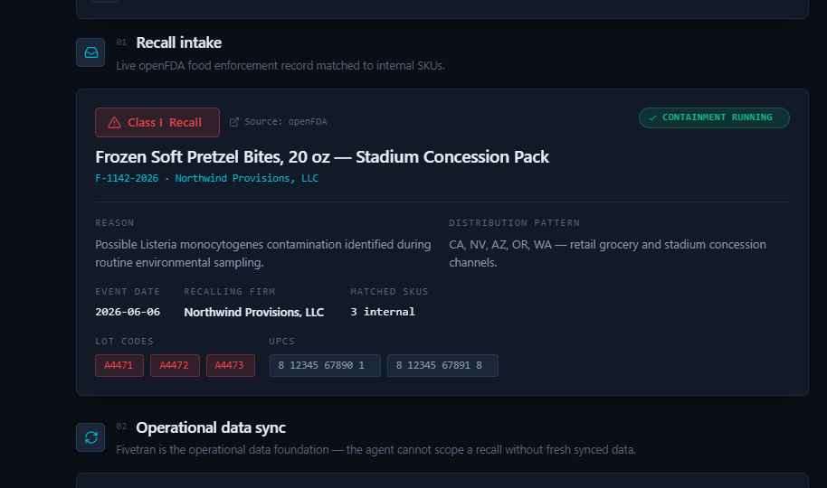
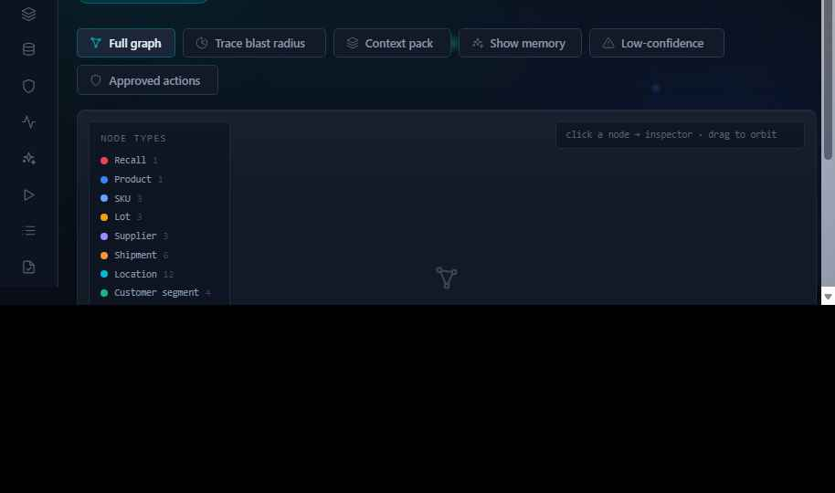
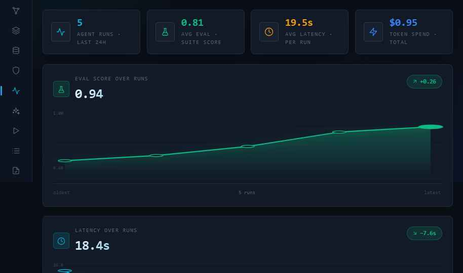
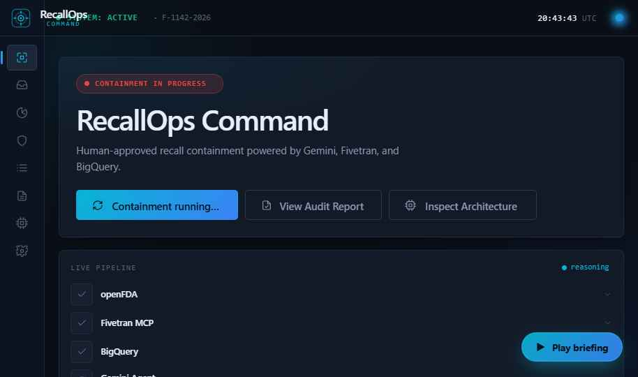
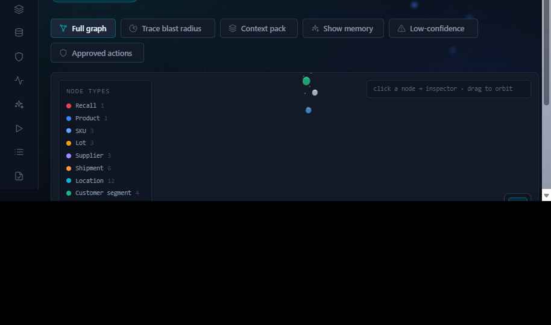
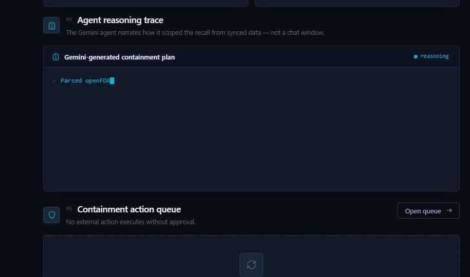
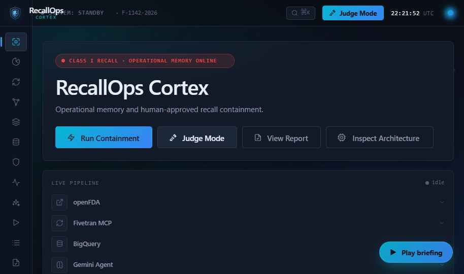

# RecallOps Cortex

> **Operational memory for recall containment.** Turn a *real* FDA recall into a
> scoped blast radius, a Gemini-drafted action plan, human approvals, and an
> audit-ready compliance report — with a tamper-evident audit trail.
>
> Google Cloud **Rapid Agent Hackathon** · **Fivetran track** · MIT licensed.

**🔗 Live demo:** <https://recall-ops.vercel.app> &nbsp;·&nbsp; **Repo:** <https://github.com/vaibhav4046/RecallOps>

> The hosted URL serves the frontend in clearly-labelled **demo / fallback** mode; it flips
> fully live (real openFDA recall + live Gemini) once the backend API is deployed to Cloud Run
> and `window.RO_CONFIG.apiBase` in `index.html` points at it.



RecallOps Cortex pulls a live openFDA food-enforcement recall, scopes it across
operational data (stores, inventory, POS, shipments, customers) synced through
**Fivetran** into **BigQuery**, has **Gemini 3** draft containment actions, gates
every external action behind **human approval**, and writes every decision to an
append-only **sha256 hash-chain** audit log.

It is **not** a chatbot and **not** a static mockup — it is a real backend
(FastAPI on Cloud Run) behind a command-center UI. The recall is always live from
openFDA; cloud integrations activate with credentials and otherwise run in
**clearly-labelled fallback**, so the demo never breaks.

---

## Architecture



**Agent flow:** `intake` (real openFDA recall) → `sync` (Fivetran → BigQuery, freshness-gated)
→ `scope` (blast radius across the warehouse) → `reason` (Gemini drafts action cards, cites
evidence) → `review` (human approves each, no auto-execution) → `report` (audit-ready).



### Data model (BigQuery / seeded warehouse)

| Table | Key columns |
|---|---|
| `recalls_raw` | recall_id · classification · product_description · recalling_firm · reason · distribution_pattern |
| `inventory_lots` | location_id · sku · lot · units |
| `pos_sales` | customer_id · sku · lot · units · consented · channel |
| `shipments` | id · supplier_id · location_id · sku · lot · status · quantity |
| `store_locations` | id · name · type · city · manager · risk_tier · lot · sku · units |
| `containment_actions` | action_id · type · priority · owner · scope · evidence_ids · approval_state · status |
| `audit_events` | event_id · actor_type · actor_name · event_type · label · evidence_ref · timestamp · prev_hash · **hash** |
| `agent_runs` | run_id · model · prompt_version · tool_count · latency_ms · token_count · eval_score · status |

Blast-radius runs as **real BigQuery jobs** over `inventory_lots / pos_sales / shipments / store_locations`;
their job IDs are surfaced as proof. The `audit_events` `hash` chains each event to the previous one
(`hash = sha256(prev_hash + event)`), so any tampering breaks the chain.

---

## What's real (verified in-browser)

- **Real recall** — `GET /api/recalls/latest` pulls a genuine openFDA Class I record
  (no key). The UI shows the live record id + retrieval time.
- **Real blast radius** — aggregated over seeded rows bound to the recall's lot codes,
  with live sync/query timestamps (and real BigQuery **job IDs** in live mode).
- **Human-approval gate** — nothing executes until a human approves; each approval
  writes a real audit event. End-to-end verified: 6 approvals → `SYSTEM: CONTAINED`
  → audit chain `intact: true`.
- **Honest status** — every integration is badged **Live** or **Fallback** — no green
  light unless it's actually wired.
- **Real observability** — the agent pipeline emits **OpenTelemetry** spans, viewable
  in `/llmops` and exportable to Arize Phoenix / Dynatrace.

---

## Partner ecosystem

Every integration is **LIVE** or **PLUGGABLE** — never faked. The `/architecture`
page renders this from real backend config.

| Partner | Role | Status |
|---|---|---|
| **Google Cloud** | Gemini 3 · Agent Builder / ADK · Cloud Run · BigQuery | core |
| **Fivetran** | MCP sync (161 ops) → BigQuery | live / pluggable |
| **Arize Phoenix** | LLM tracing + evals · OpenTelemetry | **live** (OSS, local) |
| **Dynatrace** | APM / observability via OTLP export | otlp-ready |
| **Elastic** | Recall + audit full-text search | pluggable adapter |
| **MongoDB** | Agent memory + vector similar-recalls | pluggable adapter |
| **GitLab** | CI/CD + DevSecOps pipeline (`.gitlab-ci.yml`) | in repo |

---

## The kill shot — `/graph`

**RecallGraph**, a 3D operational-memory graph expanding one FDA recall into SKUs,
lots, stores, shipments, customers, actions, evidence, memory, evals, and
improvement proposals.



## LLMOps — real agent observability



---

## Run it locally (no accounts needed)

```bash
# backend API (:8099) — real openFDA, fallback for the rest
python -m venv .venv
.venv/Scripts/python -m pip install -r backend/requirements.txt
.venv/Scripts/python -m uvicorn app.main:app --app-dir backend --port 8099

# frontend (:8790), second terminal
python -m http.server 8790
```

Open <http://127.0.0.1:8790>. Health: <http://127.0.0.1:8099/api/health>.
Smoke test the whole flow: `python backend/scripts/smoke_test.py` → `RESULT: PASS`.

**Going live** (Gemini 3 / BigQuery / Fivetran / Cloud Run deploy): see
[`docs/setup.md`](docs/setup.md) — copy-paste commands, ~$0 on free trials.

## Backend API

`GET /api/health` · `GET /api/recalls/latest` · `POST /api/recalls/select` ·
`POST /api/fivetran/sync` · `GET /api/fivetran/status` · `POST /api/blast-radius` ·
`POST /api/agent/run` · `GET /api/agent/runs` · `POST /api/actions/:id/approve` ·
`POST /api/actions/:id/reject` · `GET /api/audit/:recallId` · `POST /api/report/:recallId` ·
`GET /api/ecosystem` · `GET /api/state`. Every response carries a `trace_id`.

## Routes (14)
`/` command center · `/radar` recall radar · `/fivetran` control tower · `/graph` 3D
RecallGraph · `/context` context pack · `/evidence` evidence board · `/actions` approval
workbench · `/llmops` LLMOps tower · `/improvement` self-improvement · `/replay` crisis
replay · `/compliance` audit timeline · `/report` compliance report · `/architecture` ·
`/settings`.

## Compliance guarantees
- **No external action without human approval** — enforced server-side.
- **Tamper-evident audit** — every step timestamped with actor + evidence; the sha256
  hash chain breaks if any event is altered.
- **No fake claims** — cached/fallback data is labelled; only real integrations show "Live".

## Project structure
```
cortex/
  index.html · theme.css · *.jsx        frontend (React via CDN, no build step)
  lib/data.js · lib/api.js              seed + live API client (with labelled fallback)
  backend/app/                          FastAPI: openfda · warehouse · gemini · bigquery ·
                                        fivetran · elastic · mongodb · telemetry · audit · state
  backend/scripts/                      smoke_test · sanity_check · load_bigquery
  .gitlab-ci.yml                        lint → test (+SAST) → human-gated Cloud Run deploy
  docs/                                 architecture · setup runbook · submission pack
```

## Screens

| Command center | RecallGraph (3D) |
|---|---|
|  |  |
| **Agent reasoning + actions** | **Compliance / audit** |
|  |  |

## License
MIT — see [`LICENSE`](LICENSE).
